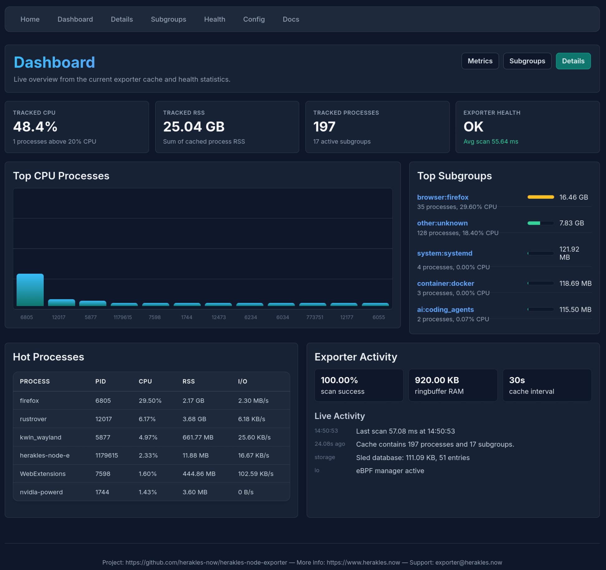

# Installation Guide

This guide covers all installation methods for the Herakles Process Memory Exporter.

Installation places the binary at `/opt/herakles/bin/`, configuration at `/etc/herakles/`, and the systemd service at
`/etc/systemd/system/herakles-node-exporter.service`.

## Prerequisites

- **Linux**: Kernel 4.14+ recommended (for `smaps_rollup` support)
- **Permissions**: Read access to `/proc` filesystem (root)

## Uninstall

Run this to uninstall `herakles-node-exporter`:

```bash
sudo herakles-node-exporter uninstall
```

<details>

<summary>Expected output</summary>

### Uninstalled Including `systemd` Service

Expected output:

```text
🗑  Herakles Node Exporter - System Uninstallation
=================================================

⚠  This will remove:
   • systemd service (stopped and disabled)
   • Binary: /opt/herakles/bin/herakles-node-exporter
   • CLI symlink: /usr/local/bin/herakles-node-exporter
   • Configuration: /etc/herakles/
   • Directories: /opt/herakles/, /var/lib/herakles/, /run/herakles/
   • BPF maps: /sys/fs/bpf/herakles/
   • Kernel parameter config: /etc/sysctl.d/99-herakles-ebpf.conf

Are you sure you want to continue? (yes/no): 
yes

🚀 Starting uninstallation...

🛑 Stopping systemd service...
   ✅ Service stopped
❌ Disabling systemd service...
Removed '/etc/systemd/system/multi-user.target.wants/herakles-node-exporter.service'.
   ✅ Service disabled
🗑  Removing systemd service file...
   ✅ Service file removed
🔄 Reloading systemd...
   ✅ systemd reloaded
🗑  Removing binary...
   ✅ Binary removed: /opt/herakles/bin/herakles-node-exporter
🗑  Removing CLI symlink...
   ℹ  CLI symlink not found, skipping
🗑  Removing configuration...
   ✅ Configuration removed: /etc/herakles
🗑  Removing directories...
   ✅ Removed: /opt/herakles
   ✅ Removed: /var/lib/herakles
   ✅ Removed: /run/herakles
   ✅ Removed: /sys/fs/bpf/herakles
🗑  Removing kernel parameter configuration...
   ✅ Sysctl configuration removed: /etc/sysctl.d/99-herakles-ebpf.conf
   ℹ  Note: Kernel parameters remain active until reboot
   To reset to system defaults immediately, run:
      • sudo sysctl -w kernel.unprivileged_bpf_disabled=2
      • sudo sysctl -w kernel.perf_event_paranoid=4

✅ Uninstallation complete!
   System has been returned to pre-installation state.
```

</details>

## Method 1: Release Installer

### One-Line Installer

```bash
curl -fsSL https://github.com/herakles-now/herakles-node-exporter/releases/latest/download/install.sh | sudo sh
```

<details>

<summary>Expected output</summary>

### Installed With `systemd` Service

```text
Installing herakles-node-exporter v0.1.1 for x86_64-linux-gnu
Running system installation
🚀 Herakles Node Exporter - System Installation
===============================================

📁 Creating directory structure...
   ✅ Directory structure created with root ownership
📦 Installing binary...
   ✅ Binary installed to /opt/herakles/bin/herakles-node-exporter
🔗 Installing CLI symlink...
   ✅ Symlink installed to /usr/local/bin/herakles-node-exporter
⚙  Generating default configuration...
   ✅ Config written to /etc/herakles/herakles-node-exporter.yaml
🔧 Installing systemd service...
   ✅ systemd unit installed
🔄 Reloading systemd...
✅ Enabling service...
Created symlink '/etc/systemd/system/multi-user.target.wants/herakles-node-exporter.service' → '/etc/systemd/system/herakles-node-exporter.service'.
🚀 Starting service...

🔧 Configuring kernel parameters for eBPF...
   ✅ kernel.unprivileged_bpf_disabled = 1
   ✅ kernel.perf_event_paranoid = 2
   ✅ Persistent configuration written to /etc/sysctl.d/99-herakles-ebpf.conf

✅ Installation complete!

Next steps:
  • Check status: systemctl status herakles-node-exporter
  • View logs:    journalctl -u herakles-node-exporter -f
  • Access:       http://localhost:9215/metrics
```

</details>

Open [http://localhost:9215/html/dashboard](http://localhost:9215/html/dashboard) to see the dashboard.

<details>

<summary>Dashboard screenshot</summary>

[](images/builtin-dashboard.png)

</details>

Specific version:

```bash
curl -fsSL https://github.com/herakles-now/herakles-node-exporter/releases/latest/download/install.sh | \
  sudo sh -s -- --version <version>
```

## Method 2: Grafana Dashboard In Docker Compose

> Due to technical restrictions by the Linux kernel and Docker it makes no sense (better wording please) to run
> `herakles-now-exporter` in containers. It cannot read useful metrics for either the container or the host there.

### Basic Setup

Run `herakles-node-exporter` on the host on port `9215`.

### Full Stack With Prometheus & Grafana

Due to technical restrictions by the Linux kernel and Docker it makes no sense (better wording please) to run
`herakles-now-exporter` in containers. It cannot read useful metrics for either the container or the host there.

But it can work very well with other containers. A Grafana dashboard backed by Prometheus running in docker-compose
can be started as described below.

### Run `herakles-now-exporter` On The Host

Run `herakles-now-exporter` on the host on port `9215`.

### Download The Grafana Dashboard Stack

```bash
# Download and unpack herakles-node-exporter-dashboard.tar.gz
curl -LO \
  https://github.com/herakles-now/herakles-node-exporter/releases/latest/download/herakles-node-exporter-dashboard.tar.gz
tar -xzf herakles-node-exporter-dashboard.tar.gz
# Or clone the repository
git clone https://github.com/cansp-dev/herakles-node-exporter.git
````

### Start Docker Compose

```bash
cd herakles-node-exporter-dashboard
# Run docker compose with docker-compose.yml
docker compose up -d
# Or use the older docker-compose command with:
# docker-compose up -d
```

### View Grafana Dashboard

1. Open [http://localhost:3000](http://localhost:3000)
2. Login with user `admin` and password `admin`

### View Prometheus Console

Open [http://localhost:9090/targets](http://localhost:9090/targets)

## Method 3: Manual installation

### Manual Binary Download

Download the matching binary from the release page.

```bash
(
    export RELEASE=latest
    export ARCH=x86_64 # or aarch64
    export C_LIBRARY=gnu # or musl
    curl -fL -o herakles-node-exporter \
      "https://github.com/herakles-now/herakles-node-exporter/releases/$RELEASE/download/herakles-node-exporter-$ARCH-linux-$C_LIBRARY"
)
chmod +x herakles-node-exporter
sudo install -m 0755 herakles-node-exporter /opt/herakles/bin/herakles-node-exporter
./herakles-node-exporter --version
```

#### Manual System-Wide Installation

Install system-wide using the downloaded binary.

```bash
# Install binary + systemd service
sudo herakles-node-exporter install

# Install without the systemd service
sudo herakles-node-exporter install --no-service

# Force reinstall over existing installation
sudo herakles-node-exporter install --force

# Uninstall
sudo herakles-node-exporter uninstall
```

## Method 4: Build From Source

The `ebpf` feature is enabled by default. Building with eBPF requires:

- a working `clang`/`llvm` toolchain
- `libelf` development headers
- a kernel with BTF support (`/sys/kernel/btf/vmlinux`)

### Release Build

```bash
# Clone the repository
git clone https://github.com/herakles-now/herakles-node-exporter.git
cd herakles-node-exporter

# Install build dependencies (Debian/Ubuntu)
sudo apt-get install -y clang libelf-dev

# Build optimized release binary
cargo build --release

# Verify binary
target/release/herakles-node-exporter --version

# Install system-wide with systemd service
sudo target/release/herakles-node-exporter install
```

### Release Build Without eBPF

```bash
# Release build without eBPF (smaller binary, no clang/BTF dependency)
make release CARGOFLAGS='--no-default-features'
```
`
### Development Build

```bash
# Build with debug symbols
cargo build

# Run directly from source
cargo run -- --help

# Run with specific options
cargo run -- -p 9215 --log-level debug
```

## Verify Release Artifacts

Download a release artifact:

```bash
export RELEASE=latest
export RELEASE_ARTIFACT=herakles-node-exporter-x86_64-linux-gnu

# Download artifact
curl -LO \
  "https://github.com/herakles-now/herakles-node-exporter/releases/${RELEASE}/download/${RELEASE_ARTIFACT}"
```

### Verify Artifact Against The `SHA256SUMS` Manifest

```bash
# Download the SHA256SUMS file
curl -LO \
  "https://github.com/herakles-now/herakles-node-exporter/releases/${RELEASE}/download/SHA256SUMS"

# Verify the artifact against the SHA256SUMS manifest
grep -E "  ${RELEASE_ARTIFACT}$" SHA256SUMS | sha256sum -c -
```

### Verify Artifact Provenance With `gh`

```bash
# Verify provenance and print a compact success message
gh attestation verify \
  "${RELEASE_ARTIFACT}" \
  --repo herakles-now/herakles-node-exporter \
  --format json \
| jq -r '"OK: " + .[0].verificationResult.statement.subject[0].name'
```

### Verify Sigstore Signature With `cosign`

```bash
# Download the Sigstore bundle
curl -LO \
  "https://github.com/herakles-now/herakles-node-exporter/releases/${RELEASE}/download/${RELEASE_ARTIFACT}.sigstore.json"

# Verify signature
cosign verify-blob \
  --bundle "${RELEASE_ARTIFACT}.sigstore.json" \
  --certificate-identity-regexp "https://github.com/herakles-now/herakles-node-exporter/.github/workflows/.*@refs/tags/v.*" \
  --certificate-oidc-issuer "https://token.actions.githubusercontent.com" \
  "${RELEASE_ARTIFACT}"
```

## Systemd Service

The installation automatically sets up a `systemd` service, starts it and prints relevant information.

> [install.sh](https://github.com/herakles-now/herakles-node-exporter/blob/main/scripts/install.sh) runs
> `herakles-node-exporter install` which sets up the service.

```bash
# Check service status
sudo systemctl status herakles-node-exporter
```

## Post-Installation

### 1. Verify System Check

```bash
herakles-node-exporter check --all
```

Expected output:
```
🔍 Herakles Process Memory Exporter - System Check
===================================================

📁 Checking /proc filesystem...
   ✅ /proc filesystem accessible
   ✅ Can read 5 process entries

💾 Checking memory metrics accessibility...
   ✅ smaps_rollup available (fast path)
   ✅ Memory parsing successful: RSS=50MB, PSS=45MB, USS=40MB

⚙️  Checking configuration...
   ✅ Configuration is valid

📊 Checking subgroups configuration...
   ✅ 140 subgroups loaded

📋 Summary:
   ✅ All checks passed - system is ready
```

### 2. Verify Configuration

```bash
# Show effective configuration
herakles-node-exporter --show-config

# Validate configuration
herakles-node-exporter --check-config
```

### 3. Test Metrics Collection

```bash
# Start exporter in foreground
herakles-node-exporter --log-level debug

# In another terminal, fetch metrics
curl http://localhost:9215/metrics | head -50

# Check health endpoint
curl http://localhost:9215/health
```

## Troubleshooting Installation

### Permission Denied

```bash
# Error: Permission denied reading /proc/*/smaps
# Solution: Run with appropriate capabilities
sudo setcap cap_dac_read_search+ep /opt/herakles/bin/herakles-node-exporter
```

### Port Already In Use

```bash
# Check what's using port 9215
sudo lsof -i :9215

# Use a different port
herakles-node-exporter -p 9216
```

### Rust Build Errors

```bash
# Ensure Rust is up to date
rustup update stable

# Clean and rebuild
cargo clean
cargo build --release
```

### Missing smaps_rollup

```bash
# Check kernel version (4.14+ required for smaps_rollup)
uname -r

# The exporter will fall back to smaps if smaps_rollup is unavailable
# Performance may be reduced on older kernels
```

### Running As Non-Root User

Reading `/proc/<pid>/smaps_rollup` for processes owned by other users requires root privileges. This file provides
accurate USS (Unique Set Size) figures. Without root, USS data for root-owned processes is unavailable and those
processes are silently excluded from group memory metrics.

For complete multi-user system monitoring, the exporter is intended to run as `root`. The built-in installer sets up
the systemd service as `User=root` / `Group=root` so the process retains the `/proc` access and eBPF privileges it
needs.

Check effective user before debugging missing processes:

```bash
ps aux | grep herakles-node-exporter
# Should show: root ... herakles-node-exporter
```

## Next Steps

- [Configure the exporter](Configuration.md)
- [Set up Prometheus integration](Prometheus-Integration.md)
- [Understand the metrics](Metrics-Overview.md)

## 🔗 Project & Support

Project: <https://github.com/herakles-now/herakles-node-exporter> — More info: <https://www.herakles.now> — Support: <exporter@herakles.now>
